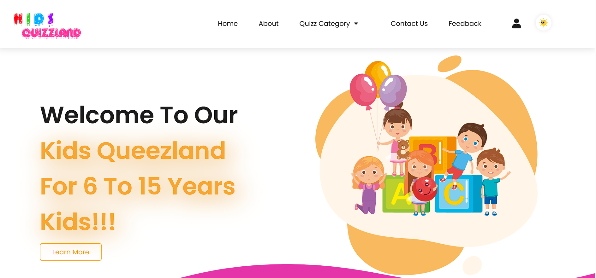
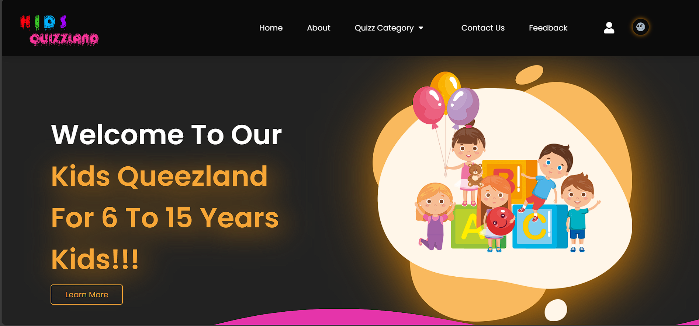

# ***Kids Quizzland🌟***
### Website link: https://kids-quizzland.netlify.app

## ***Hi! I'm happy to see you here!***
#### Welcome to Kids Quizzland! This is a fun, educational, and interactive website designed for kids aged 6 to 15. Kids Quizzland offers a variety of quizzes on general knowledge, math, English, and fun games to encourage learning through play🚀.

## Aboutus

Kids Quizzland is a vibrant and engaging platform where kids can explore and learn through quizzes. Our goal is to make learning enjoyable by providing quizzes in a simple and funny language, accompanied by fun stickers and images.This is a very interactive layout of our website.

## Features

- About us
- Quizz-Category
- Login Profile for user
- Contact us
- Free and Open-Source Platform
- Interactive Design: User-friendly interface with engaging graphics and stickers.
- Responsive Layout: Optimized for mobile, tablet, and desktop devices.

## Our Quizzes-Category
- General Knowledge Quizzes: Test your knowledge on a variety of topics.
- Math Quizzes: Solve math problems in a fun and interactive way.
- English Quizzes: Improve your language skills with interesting questions.
- Fun and Game Quizzes: Enjoy fun quizzes and games designed to entertain and educate.

#### We making this project for dark mode also gives very interactive and responsive layout. ####

## Contributors

 

## Support

**If you find our projects helpful or interesting, consider giving them a ⭐ it means our lot of us!!!**